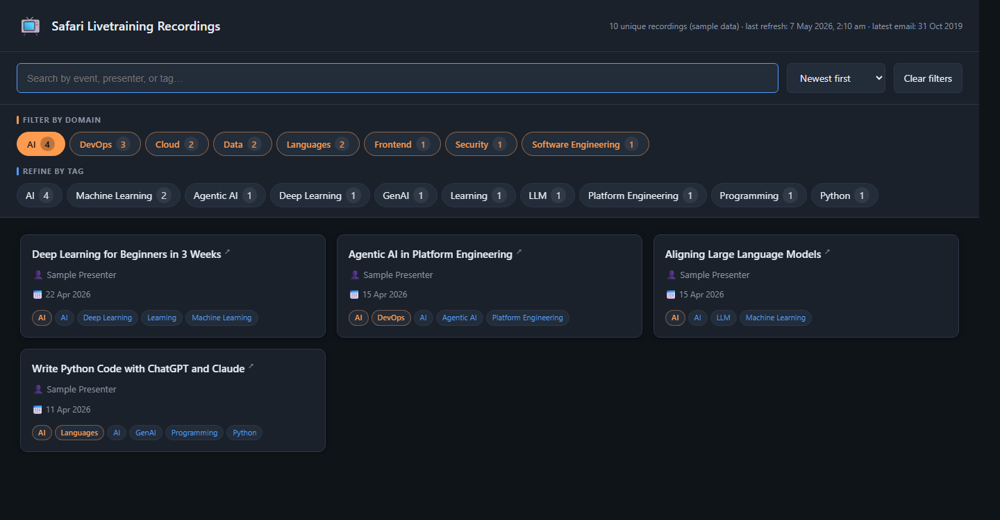

# Safari Recordings Dashboard

A local single‑page dashboard that turns your folder of O'Reilly /
Safari **Live Online Training** *"Recording is now available"* emails into a
searchable, tag‑filterable catalogue of every course you've ever attended.

The links inside those emails expire after a few weeks, so this tool focuses
on what *doesn't* expire: the **course title** and **presenter**. Click any
title in the dashboard and it opens the matching O'Reilly Learning live‑course
search in a new tab.

> 
>
> *Screenshot: dashboard with the bundled `data.sample.json` (10 anonymised entries).*

---

## Architecture

```
┌──────────────────────┐
│ Outlook desktop      │   1. Drag selected recording emails
│ (your mailbox)       │ ────────────────────────────────────────────┐
└──────────────────────┘                                              ▼
                                                       ┌─────────────────────────┐
                                                       │  dump/                  │
                                                       │  (.msg / .eml files)    │
                                                       └────────────┬────────────┘
                                                                    │ 2. python scripts/fetch_emails_msg.py
                                                                    ▼
┌──────────────────────────────────────────────────────────────────────────────┐
│  ingestion pipeline (pure Python — no auth, no admin consent)                │
│                                                                              │
│  extract-msg / email.parser   ─►   subject prefix match  ─►   parse          │
│  parse → (event, presenter, received_date)                                   │
│  assign_tags(event)        — keyword → detail tag rules (~190)               │
│  assign_domains(tags)      — detail tag → top-level domain rollup            │
│  dedup by (event, presenter), keep latest received_date                      │
└──────────────────────────────────────────────────────┬───────────────────────┘
                                                      │ 3. write JSON
                                                      ▼
                                       ┌──────────────────────────────────┐
                                       │ data/data.json   (real, ignored) │
                                       │ data/data.sample.json (committed)│
                                       │ data/state.json  (watermark)     │
                                       └────────────────┬─────────────────┘
                                                        │ 4. fetch (real → fallback to sample)
                                                        ▼
┌──────────────────────────────────────────────────────────────────────────────┐
│  SPA (browser)                                                               │
│   ┌────────────────────────────────────────────────────────────────────┐     │
│   │ Search │ Sort │ Clear filters                                      │     │
│   ├────────────────────────────────────────────────────────────────────┤     │
│   │ Domains:  AI · Data · Cloud · DevOps · Frontend · Security · …     │     │
│   │ Tags  (when a domain is selected): LLM · Kubernetes · React · …    │     │
│   ├────────────────────────────────────────────────────────────────────┤     │
│   │ ┌─ event title (clickable) ──────────────────────────────────────┐ │     │
│   │ │ 👤 presenter      📅 date     [domain chips] [tag chips]       │ │     │
│   │ └────────────────────────────────────────────────────────────────┘ │     │
│   │                                  …                                 │     │
│   └────────────────────────────────────────────────────────────────────┘     │
│                                  │                                           │
│                                  ▼ click title                               │
│   https://learning.oreilly.com/search/?q=<event>&type=live-course&…          │
└──────────────────────────────────────────────────────────────────────────────┘
       ▲
       │ served by scripts/serve.py  (no-cache HTTP, 127.0.0.1 only)
       └─ launched by run.ps1
```

---

## What it does

- **Ingests** `.msg` and `.eml` email files from a local `dump/` folder.
- **Recognises** every variant of O'Reilly's recording subject line, e.g.
  `[EXTERNAL] Recording: …`, `[EXTERNAL] Online Training Recording: …`,
  `Online Training Recording: …`, plain `Recording: …`, etc.
- **Extracts** event title, presenter, and received date.
- **Tags** each entry with detailed topic tags (≈190 keyword rules) and rolls
  those tags into 12 top‑level **domains**: AI, Data, Cloud, DevOps, Backend,
  Frontend, Languages, Security, Software Engineering, Mobile,
  Career & Soft Skills, Other.
- **De‑duplicates** by `(event, presenter)` keeping the latest received date,
  so the same training presented twice is shown once.
- **Renders** a fast, dark‑mode SPA with full‑text search, domain chips,
  refinable sub‑tag chips, and four sort orders.
- **Links out** — click a course title to open the prefilled O'Reilly
  Learning live‑course search in a new tab.

The repo ships with a **10‑entry anonymised `data.sample.json`** so you can
clone, run `run.ps1`, and see the dashboard immediately.

---

## Requirements

| Component                | Cross‑platform | Notes |
| ------------------------ | :-:            | --- |
| SPA + local server       | ✅              | Pure HTML/JS/CSS + a tiny Python HTTP server |
| `.msg` / `.eml` parser   | ✅              | `extract-msg` is pure Python, runs anywhere |
| Drag‑from‑Outlook export | Windows‑only   | Requires Outlook desktop |

You need:
- **Python 3.10+**
- The Python package in `requirements.txt`:
  `pip install -r requirements.txt`

> This repo intentionally does **not** include direct mailbox / Microsoft
> Graph / Outlook COM ingestion. The Outlook drag‑to‑folder workflow is the
> only path supported here, because it works on managed corporate machines
> where Graph & COM are often blocked by Conditional Access or admin consent
> policies.

---

## Quick start

```bash
git clone https://github.com/SuchitChoudhury/safari-recordings-dashboard.git
cd safari-recordings-dashboard
pip install -r requirements.txt
```

### Option A — explore the sample (no Outlook needed)
On Windows:
```powershell
.\run.ps1
```
On macOS / Linux:
```bash
python scripts/serve.py
```
Either opens <http://localhost:8765/> with the bundled 10‑entry sample.

### Option B — load your own emails
1. In Outlook, select the recording emails you want and **drag them into the
   `dump\` folder** of this repo (creates one `.msg` per message).
2. Run the ingester:
   ```powershell
   python scripts\fetch_emails_msg.py --no-merge
   ```
3. The script exits **0** with `OK — all N file(s) processed cleanly. Safe to
   delete the dump folder.` only when **every** file was ingested without
   error. If anything failed to open or parse, you'll see a non‑zero exit and
   a per‑file failure list — do **not** delete the dump folder until those are
   resolved.
4. Refresh the browser tab. Your real `data/data.json` (gitignored) is now
   used in preference to `data/data.sample.json`.

### Incremental adds
Drop more `.msg` / `.eml` files into `dump\` and run:
```powershell
python scripts\fetch_emails_msg.py            # merges into existing data
```
Dedup ensures repeated recordings of the same event by the same presenter
collapse to a single entry (the most recent date wins).

---

## How tagging works

Two tables in `scripts/tagging.py` drive everything:

### 1. Detail tags — `TOPIC_RULES`
Ordered list of `(keyword_substring, [tags])`. The lower‑cased event title is
scanned; every matching rule contributes its tags (set union). Examples:

| Title                                                | Tags                                                |
| ---------------------------------------------------- | --------------------------------------------------- |
| SQL Foundations for Data Analysis                    | `SQL`, `Data Analysis`                              |
| Deep Learning for Beginners in 3 Weeks               | `AI`, `Deep Learning`, `Learning`, `Machine Learning` |
| Microsoft Fabric Data Engineer Associate Bootcamp    | `Azure`, `Certification`, `Data Engineering`, `Microsoft Fabric` |
| Aligning Large Language Models                       | `AI`, `LLM`, `Machine Learning`                     |
| Write Python Code with ChatGPT and Claude            | `AI`, `GenAI`, `Programming`, `Python`              |

Anything with no match is tagged `Uncategorized` so you can spot gaps.

### 2. Domain rollup — `TAG_TO_DOMAINS`
Maps each detail tag to one or more top‑level domains. Domains are what the
SPA shows as the primary chip row; selecting a domain reveals only its
relevant detail tags. This keeps the filter UI usable with hundreds of tags.

### Tweak tags without re‑reading email
After editing rules:
```powershell
python scripts\retag.py
```
Re‑applies tags & domains to every entry in `data/data.json` in place. No
emails are re‑parsed.

---

## SPA features

- **Full‑text search** across event, presenter, tags, and domains.
- **Domain chips** (orange) — primary filters; multiple selected = OR.
- **Tag chips** (blue) — appear when at least one domain is active; multiple
  selected = AND. Drilling down feels obvious.
- **Sorts:** Newest first, Oldest first, Event A→Z, Presenter A→Z.
- **Click the title** to open `https://learning.oreilly.com/search/?q=…&type=live-course&rows=100&language=en`
  prefilled with the course name in a new tab.
- **No build step.** Just static `index.html` + `app.js` + `styles.css`.
- **No‑cache server** (`scripts/serve.py`) so edits to the SPA are picked up
  on the next browser refresh — no hard‑refresh needed.
- **Shareable filter URLs.** Filters can be pre-applied via the URL hash, so
  you can bookmark or share a filtered view:
  - `…/#domain=AI` — pre-select the AI domain
  - `…/#domain=Cloud,DevOps&tag=Kubernetes` — multiple domains and a tag
  - `…/#q=react` — pre-fill the search box

---

## Data schema

Each entry in `data/data.json` (and the sample) has at minimum:

| Field       | Type            | Required | Description |
| ----------- | --------------- | :-:      | --- |
| `event`     | string          | ✅        | Course title (used for search & search URL) |
| `presenter` | string          | ✅        | Presenter name(s) |
| `received`  | `YYYY-MM-DD`    | ✅        | Date the recording email arrived (UTC) |
| `domains`   | string[]        | ✅        | Top‑level domain rollup (computed from tags) |
| `tags`      | string[]        | ✅        | Detail tags (computed from event title) |
| `subject`   | string          | optional | Original raw email subject |
| `sender`    | string          | optional | Sender SMTP address |
| `source_file` | string        | optional | Path of the .msg/.eml the entry was ingested from |
| `dedup_key` | string          | internal | `lower(event)\|\|lower(presenter)` — used by ingester |

The SPA only reads `event`, `presenter`, `received`, `domains`, `tags`. The
shipped sample omits everything else.

---

## File layout

```
safari-recordings-dashboard/
├─ index.html                 SPA shell
├─ app.js                     SPA logic (search, filter, sort, render)
├─ styles.css                 SPA styles (dark mode)
├─ run.ps1                    Windows launcher (starts server + opens browser)
├─ requirements.txt           extract-msg
├─ LICENSE                    MIT
├─ README.md                  this file
├─ data/
│   ├─ data.sample.json       10 anonymised entries (committed)
│   └─ data.json              your real data (gitignored — created by ingester)
├─ scripts/
│   ├─ tagging.py             SUBJECT_PREFIXES, TOPIC_RULES, TAG_TO_DOMAINS, helpers
│   ├─ fetch_emails_msg.py    ingests .msg/.eml from dump/ → data/data.json
│   ├─ retag.py               re-applies tagging.py to data/data.json in place
│   └─ serve.py               no-cache local HTTP server
└─ dump/                      drop .msg / .eml here (gitignored)
```

---

## Privacy & gitignore

The repo's `.gitignore` blocks the things you almost certainly don't want
public:

- `dump/` — raw email files include your address, headers, and full body
- `data/data.json` — your personal training history
- `data/state.json`, `data/ingest_report.json`, `data/fetch.log` — per‑run
  metadata
- `data/.msal_cache.bin` — Microsoft auth token cache (only created by
  removed Graph code; ignored as a defence‑in‑depth measure)

If you ever modify the SPA to fetch additional fields, double‑check whether
those fields belong in a public dataset before committing.

---

## Troubleshooting

- **`fetch_emails_msg.py` says `subject-mismatch` for some files.** Those
  emails don't start with one of the recognised recording subject prefixes.
  The most common offender is the `[EXTERNAL] Your event recording is ready.`
  notification email — it carries no event/presenter, so it's correctly
  skipped. If you have a real recording email being skipped, add its prefix
  to `SUBJECT_PREFIXES` in `scripts/tagging.py`.
- **`open-fail` on a file.** `extract-msg` couldn't read it (corrupt or
  unsupported format). The script exits non‑zero and lists the file; either
  re‑drag it from Outlook or delete just that one file.
- **Lots of `Uncategorized` entries.** Add new keyword rules to `TOPIC_RULES`
  in `scripts/tagging.py`, then run `python scripts/retag.py`.
- **SPA shows the bundled sample even after ingesting.** Hard refresh the
  page (`Ctrl + Shift + R`) once. The no‑cache headers prevent this from
  happening again.
- **Server says port already in use.** Pass `-Port`, e.g. `.\run.ps1 -Port 9000`.

---

## License

MIT — see [LICENSE](LICENSE).
